# Erelia — Game Design Document

**Status:** Working design baseline  
**Revision:** 18 September 2026  
**Project:** Erelia  
**Genre:** Persistent online voxel fantasy RPG with third-person exploration and tactical turn-based combat  

> This document consolidates the current design decisions for the new version of Erelia. Exact numeric values are intentionally left configurable unless they have already become part of the design. Systems described as future extensions are not required for the first playable version.

Implementation planning: [Erelia implementation backlog](../backlog/README.md). The GDD defines gameplay and visual intent; the backlog records implementation sequencing, architecture and acceptance criteria.

---

# 1. Game Vision

Erelia is a persistent online fantasy RPG built around four connected experiences:

1. **Explore** deterministic voxel Worlds and discover resources, camps, dungeons, routes and points of interest.
2. **Develop** shared server infrastructure by gathering resources and upgrading permanent towns and frontier outposts.
3. **Build** classless Heroes through equipment, spells and deliberate loadout combinations rather than levels or predefined classes.
4. **Fight** in tactical cell-based encounters that are created directly from the same voxel terrain used during third-person exploration.

The game should feel like a persistent expedition through increasingly dangerous Worlds. Players begin near established civilization, push the server frontier outward by defeating Grand Dungeons, and progressively rely on community-maintained outposts as permanent towns become more distant.

Erelia is also intended to validate the networking, voxel and multiplayer architecture that may later be integrated into Sparkle. The gameplay must remain the reason those systems exist; cloud, telemetry and distributed-server work should support the game rather than dictate it.

## 1.1 Core design pillars

### Persistent shared progression

Important server achievements belong to the server community. Permanent town buildings and World portals are shared progression. When a server develops infrastructure or unlocks a new World, all players on that server benefit.

### Classless character building

There are no classes and no Feat trees in the current design. A Hero is not a healer, tank, mage or ranger by definition. A Hero simply has equipment, stats and eight equipped spells whose requirements are satisfied by that equipment.

A Hero wearing defensive equipment and carrying healing spells may behave like a defensive support character. Changing the loadout may completely change that role.

### Player-driven economy

Finished equipment, spells, tools and consumables are intended to be crafted and traded by players. The world generates resources, gold, recipes, demand and opportunities; players generate most usable items.

Item durability permanently removes used items from the economy, creating continuous demand for new production.

### Geography matters

Distance from civilization should matter. Not every World contains a permanent town. Higher Worlds may require players to travel through several portals before reaching their objective. Fixed-size expedition inventories, global banks and temporary public outposts create logistical pressure without turning the game into a full transport simulator.

### Tactical combat emerges from the world

Combat does not load an unrelated arena. The tactical battlefield is derived from the actual voxel terrain surrounding the combatants. The same cliff, bridge, stair, slope or corridor seen during exploration becomes part of the battle.

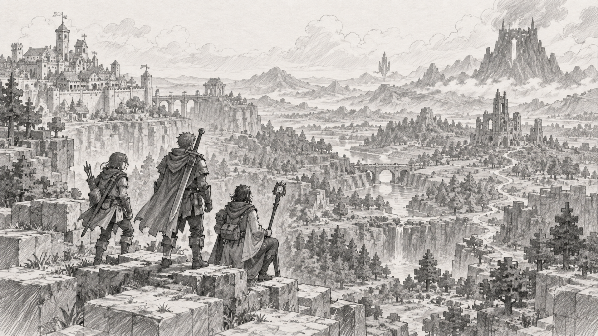

*Three Heroes prepare to leave a permanent settlement and explore the voxel frontier.*

## 1.2 Unified multi-scale voxel visual identity

Terrain, Heroes, creatures, equipment and props share one voxel visual language and the same fundamental voxel-volume representation. Terrain uses world-scale cells; models use finer cells with independently defined volume dimensions and scale.

A terrain Chunk contains 16×16×16 cells at one world unit per cell. A model can contain an arbitrary runtime-sized grid, such as 8×8×16 cells, with a smaller configurable uniform cell size. Grid resolution and displayed size are distinct: an 8×8×16 model at 0.1 unit per cell occupies 0.8×0.8×1.6 local units before its object transform.

Both use the same voxel Definitions, normalized Shapes and material system. Cubes, slabs, slopes and stairs remain available at either scale; a voxel visual identity does not require every surface to be a full cube.

Heroes and other animated characters are assemblies of rigid voxel-volume parts connected through a transform hierarchy. Animation moves and rotates those parts; it does not normally rewrite their cells or rebuild their meshes. Visible equipment uses separate voxel models attached to the character. Proportions, palettes and the final visual treatment remain subject to the visual-validation milestone in Section 42.

The initial material direction is palette/color-based, with stable variation across terrain boundaries and patterns that remain attached to moving models. More advanced material effects are later extensions. Existing texture-atlas rendering remains supported during migration and visual comparison.

---

# 2. Core Player Loop

The main progression loop of a World is:

```text
Explore the World
    ↓
Discover resource zones, enemy camps, quests, dungeons and routes
    ↓
Gather raw resources
    ↓
Refine materials
    ↓
Contribute to shared town buildings and craft better tools
    ↓
Craft / enchant / trade equipment, spells and consumables
    ↓
Improve Hero loadouts
    ↓
Clear normal dungeons for rare resources, training and access
    ↓
Prepare for the Grand Dungeon
    ↓
Defeat the Grand Dungeon
    ↓
Activate the portal to the next World for the entire server
```

Players are not required to complete every normal dungeon. Dungeons provide different opportunities, resources, information and access routes. The player chooses how much preparation is necessary before attempting the Grand Dungeon.

Higher Worlds are primarily vertical progression. Their resources, items, spells and enemies are stronger and more expensive. Older Worlds may become mechanically less relevant to veteran players, while still providing an accessible economic starting point for newer players who need to gather, craft, sell and accumulate gold before operating in higher tiers.

---

# 3. Servers, Seeds and Persistent Worlds

## 3.1 Server model

Erelia is designed for an official persistent multiplayer server model while allowing private servers.

Each server owns its progression state, economy, town upgrades, active outposts, World portals, resource state and dynamic overworld content.

Private servers should be able to reproduce the deterministic generation of another server by using the same generation configuration.

## 3.2 Server seed

A server has a root `ServerSeed`.

World generation derives deterministic World seeds from that root:

```text
WorldSeed = Hash(ServerSeed, WorldID)
```

All players on the same server therefore observe the same base World geometry.

Two servers may deliberately use the same `ServerSeed` to reproduce equivalent generated Worlds while maintaining separate progression and runtime state.

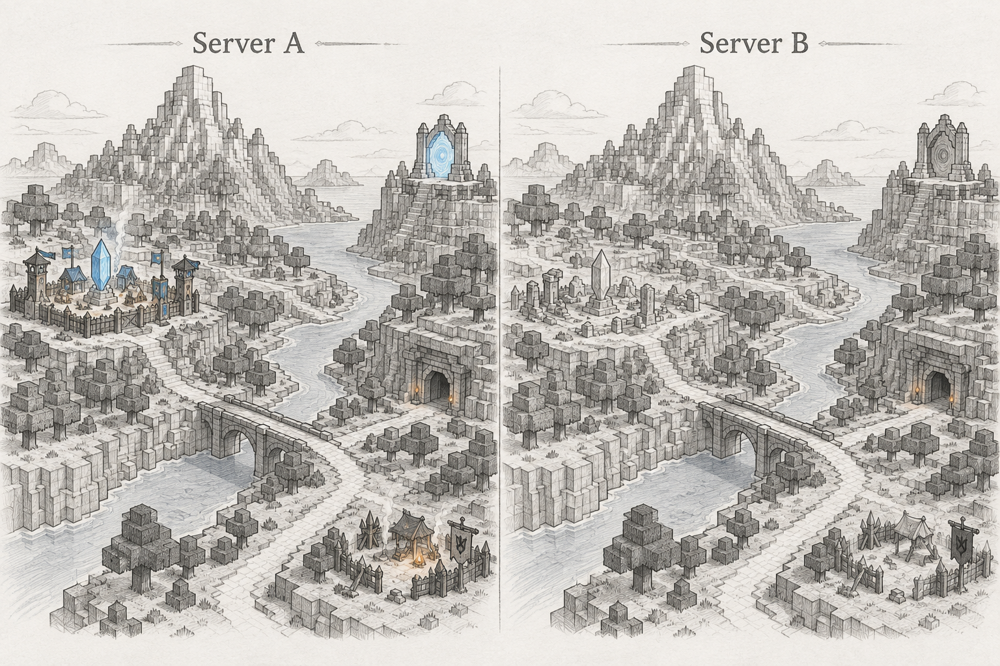

*The same seed produces matching terrain, while each server maintains its own outpost and portal state.*

## 3.3 Immutable voxel environment

The base voxel environment is immutable during ordinary gameplay.

Players do not mine terrain blocks, place arbitrary terrain blocks, dig tunnels or permanently modify World geometry. Voxels are the representation and generation system of the world, not a Minecraft-like construction mechanic.

This has several benefits:

- deterministic chunk regeneration;
- simpler authoritative networking;
- simpler persistence;
- stable navigation data;
- repeatable dungeon and World generation;
- combat can freely create temporary objects without corrupting permanent terrain state.

---

# 4. World Structure and Frontier Progression

## 4.1 Worlds

A World is a persistent voxel region with its own terrain generation, biomes, enemies, resources, points of interest, dungeons and progression tier.

A World may contain:

- wilderness regions;
- resource gathering zones;
- permanent towns;
- NPC quest locations;
- enemy camps;
- normal dungeons;
- a Grand Dungeon;
- dormant outpost crystals;
- portals linking adjacent Worlds.

Not every World must contain a permanent town.

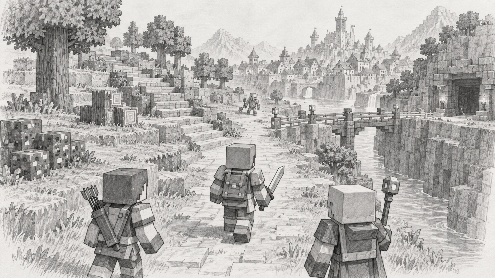

*First-World visual proposal, showing a practical exploration camera and relative scale.*

## 4.2 World portals

Each World has a dedicated portal location connecting it to the previous World. The arrival location in the next World is located near a return portal leading back.

The portal leading to the next World begins inactive.

When the Grand Dungeon of the current World is defeated for the first time on that server:

```text
Grand Dungeon defeated
    ↓
Next-World portal activates permanently
    ↓
Every player on the server can use it
```

World access is therefore **server-wide progression**, not personal progression.

A player does not need to personally defeat every previous Grand Dungeon if the server community has already opened those Worlds.

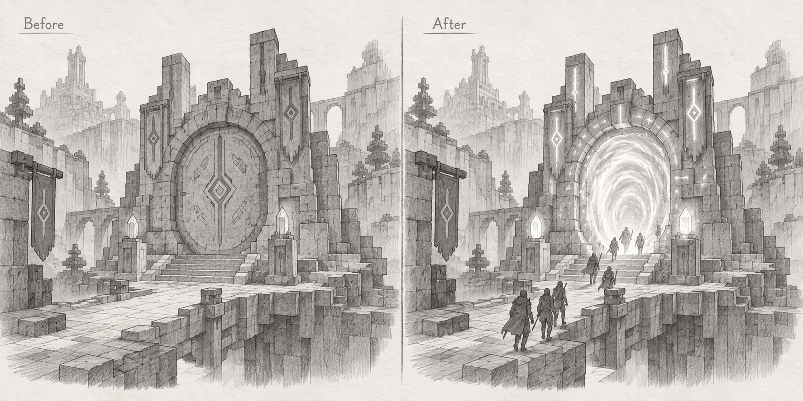

*The first Grand Dungeon victory permanently opens the next-World portal for everyone on the server.*

## 4.3 Sparse permanent civilization

Permanent towns should not necessarily exist in every World.

This creates geographical gravity around major settlements and makes higher-tier activity feel like an expedition rather than a sequence of equivalent hubs.

A possible progression could resemble:

```text
World 1 — Permanent Town
    ↓
World 2 — Wilderness
    ↓
World 3 — Wilderness
    ↓
World 4 — Permanent Town
```

The exact spacing is content dependent.

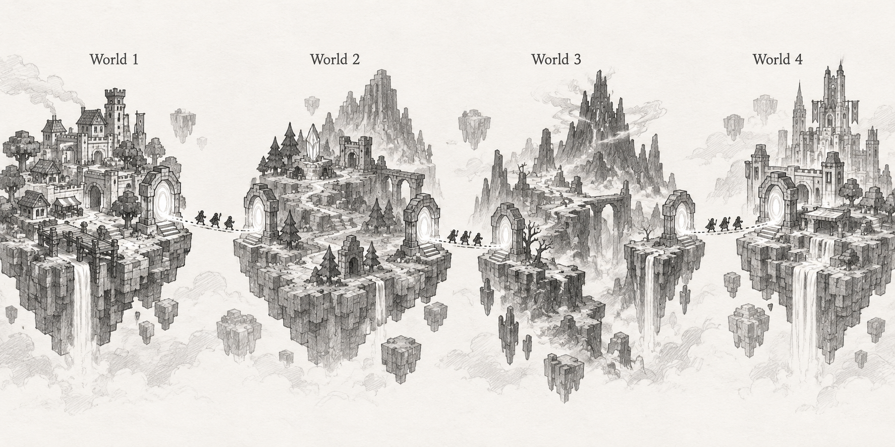

*Portal-linked Worlds separate permanent towns with stretches of wilderness, making frontier travel an expedition.*

## 4.4 Vertical World progression

Higher Worlds primarily supersede lower Worlds in terms of power tier.

A higher World generally provides:

- higher-tier raw resources;
- higher-tier refined materials;
- stronger enemies;
- stronger normal dungeons;
- stronger Grand Dungeon;
- higher-tier crafting recipes;
- higher-tier spells and equipment production.

The game does not artificially force veteran players to farm obsolete lower-tier regions. Lower Worlds naturally remain relevant to newer or poorer players because their costs and risks are lower.

---

# 5. Permanent Towns

Permanent towns are the major social and economic anchors of the server.

## 5.1 Independent building progression

There is no global Town Level.

Each building progresses independently through its own server-wide upgrade track.

Example:

```text
Forge I → Forge II → Forge III
Mage Tower I → Mage Tower II → Mage Tower III
Enchantment Building I → II → III
Workshop I → II → III
Alchemist I → II → III
```

Players collectively decide what to prioritize by choosing where to contribute resources.

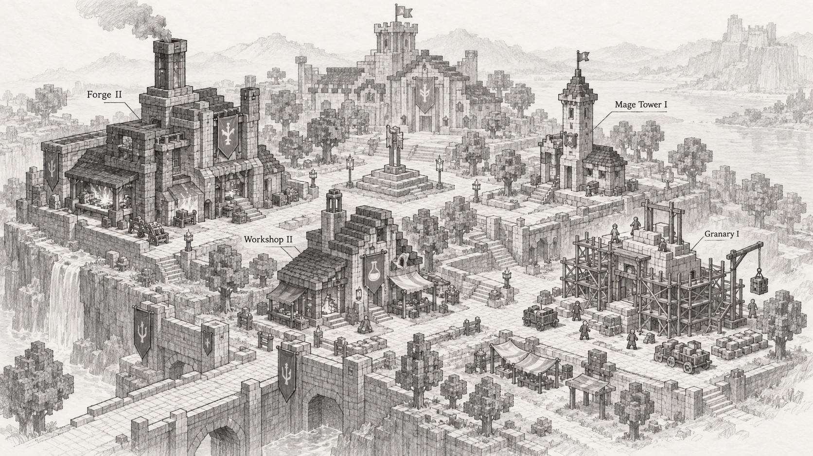

*Town buildings advance independently as players contribute to each facility's shared upgrade requirements.*

## 5.2 Server-wide upgrades

A building upgrade requires a predefined resource contribution.

Example:

```text
Mage Tower II
- 5,000 Stone
- 2,000 Refined Metal
- 500 Arcane Crystal
```

Any player may contribute resources. Contributions accumulate server-wide. Once every requirement is satisfied, the upgrade becomes permanently available to all players on that server.

## 5.3 Building roles

The exact building list remains expandable, but the current design includes the following roles.

### Guild Center

The Guild Center is the player's main Hero-management location.

It provides:

- creation of blank Heroes;
- access to the full Hero roster;
- selection of the active three-Hero squad;
- equipment and spell loadout management;
- formation/follower configuration;
- access to the shared bank where appropriate;
- a likely permanent respawn-point service.

### Crafting buildings

Crafting buildings convert refined materials into player-made items. Different item families may use different facilities, such as a Forge, Workshop or Mage Tower.

Upgrading a crafting building unlocks higher-tier recipes and production possibilities.

### Mage Tower

The Mage Tower enables the production of increasingly advanced spell items and magical recipes. It does not assign a Mage class and does not automatically teach spells to Heroes.

### Enchantment Building

The Enchantment Building modifies existing items by adding, removing or transforming Tags and, for some operations, modifying item Type or stats.

Its own upgrade track unlocks more advanced enchantments.

### Alchemist

The Alchemist supports the production of potions and other consumables.

### Workshop / Tool production

Tool-producing facilities unlock higher-tier gathering tools such as pickaxes and axes.

---

# 6. Temporary Frontier Outposts

Higher Worlds can contain predefined **Dormant Crystal Sites** located near strategically useful places such as dungeons, rare resource zones and major points of interest.

Players cannot place these sites freely. Their locations are created by World generation or authored content.

## 6.1 Activation

A dormant crystal can be activated by the server community.

Activation automatically creates a predefined outpost with a fixed set of services. Players do not freely construct voxel buildings.

An active outpost can provide services such as:

- teleportation toward a permanent town in a lower World;
- repair station;
- marketplace access;
- global bank/storage access;
- Guild Center-style Hero roster and squad management.

Additional services may be added later where useful.

## 6.2 Public infrastructure

Outposts are public. Any player may use an active outpost regardless of who originally activated or maintained it.

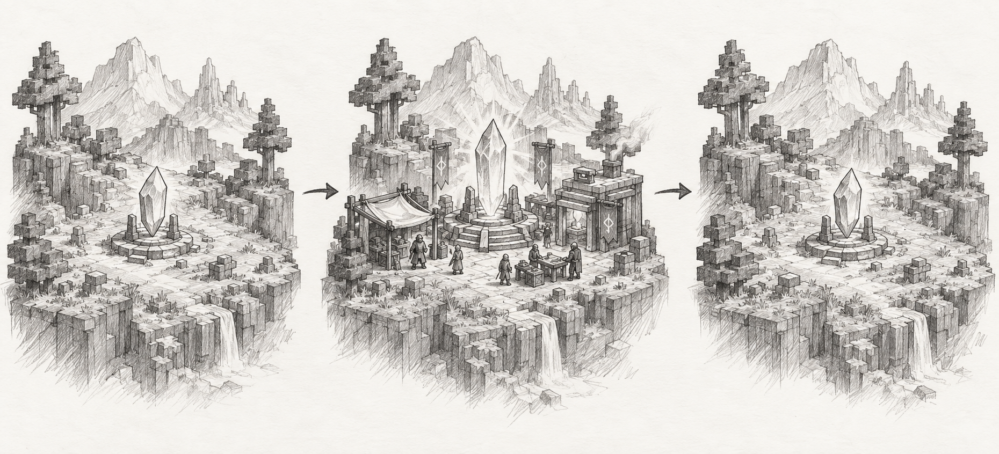

*A predefined crystal site provides public outpost services while upkeep lasts, then returns to dormancy.*

## 6.3 Upkeep

An active outpost consumes resources over time through its crystal.

Players may feed resources into the crystal to preload upkeep time.

```text
Crystal resources available
    ↓
Outpost remains active

Resources reach zero
    ↓
Outpost deactivates
    ↓
Facilities disappear / become unavailable
    ↓
Crystal remains dormant and can be reactivated later
```

Outposts create an ongoing resource sink after permanent town upgrades have been completed.

---

# 7. Heroes and Roster

## 7.1 Blank Heroes

Heroes are intentionally close to blank templates.

The current first-version design does not require classes, Feats, character levels or profession levels.

Racial base-stat differences may be explored later, but are not necessary for the initial system.

A Hero's role emerges primarily from:

- equipped items;
- item stats;
- item Types;
- item Tags;
- eight equipped spells;
- tactical decisions.

## 7.2 Unlimited roster, three active Heroes

At a Guild Center, a player may create and manage as many blank Heroes as desired.

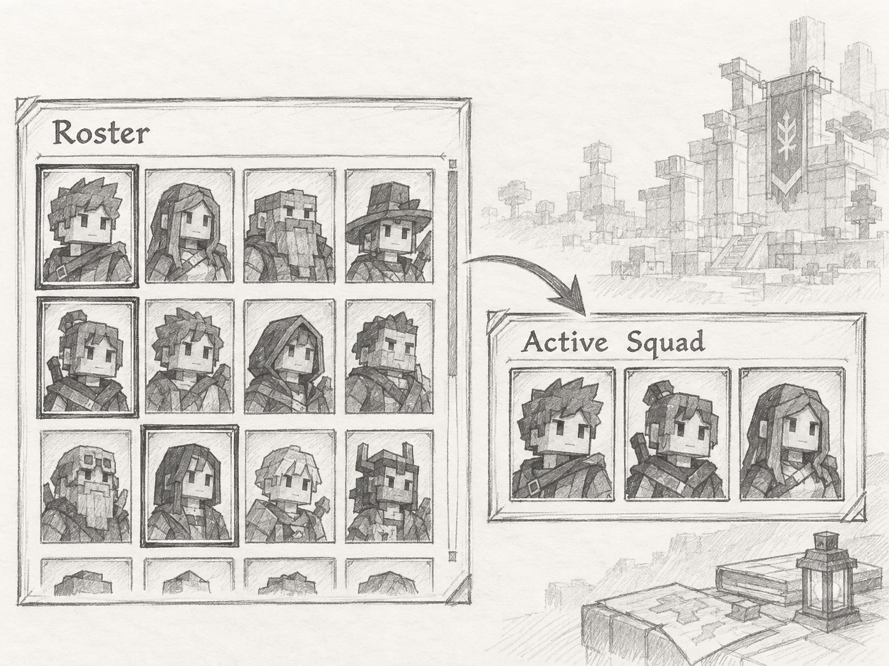

*An unlimited Hero roster supplies a selected active squad of exactly three Heroes.*

While adventuring, the player uses an active squad of **three Heroes**.

In multiplayer, each player contributes their own squad.

```text
1 player → 3 Heroes
2 players → up to 6 Heroes
3 players → up to 9 Heroes
```

A larger multiplayer party therefore increases the total number of units rather than replacing one player's Hero slots.

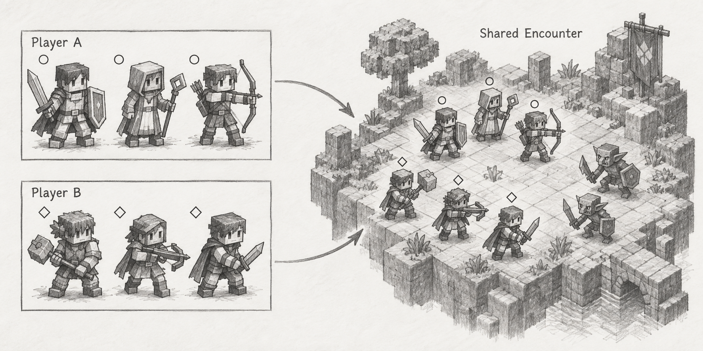

*Each player retains ownership of three Heroes when their squads join a shared tactical encounter.*

## 7.3 No equipment proficiency gates

If a player obtains a high-tier item, a blank Hero may use it immediately as long as its equipment-slot rules are valid.

There are no hidden requirements such as:

- character level;
- weapon mastery;
- Feat prerequisite;
- World-completion requirement.

The difficulty and economic cost of acquiring the item are the progression gate.

---

# 8. Hero Equipment and Loadouts

## 8.1 Equipment slots

The baseline equipment layout is:

- Main Hand;
- Off Hand;
- Head;
- Chest;
- Legs;
- Boots;
- Accessories.

The exact number of accessory slots remains tunable.

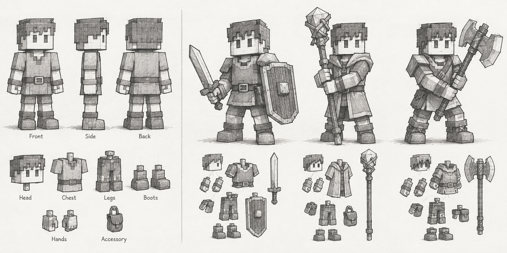

*Visual proposal: proportions and equipment attachment remain exploratory; the selected representation is an articulated assembly of voxel-volume parts (Section 1.2).*

## 8.2 Hand occupancy

Item definitions specify their hand requirements.

Examples:

```text
Sword → Main Hand
Shield → Off Hand
Two-Handed Axe → Main Hand + Off Hand
Staff → Main Hand + Off Hand
```

Two-handed equipment therefore prevents simultaneous use of an off-hand item.

## 8.3 Item Type

Every equipment item has exactly one **Type**.

Examples:

- Sword;
- Axe;
- Shield;
- Plate Armor;
- Nature Staff;
- Divine Staff.

Type is semantic data used mainly by spell requirements and effect formulas.

## 8.4 Item Tags

Every item may have zero or more **Tags**.

Examples:

- Cursed;
- Flame;
- Military;
- Nature.

Tags have **no intrinsic gameplay effect**.

A `Flame` item does not automatically add fire damage. A `Cursed` item does not automatically apply a penalty.

Tags exist so that spells can query the equipped loadout for:

- cast availability;
- scaling;
- conditional effects;
- target or behavior changes.

## 8.5 Randomized item stats

Each recipe defines ranges for the stats of the resulting crafted item.

Two items created from the same recipe may therefore have different values.

Example:

```text
Steel Sword recipe
Physical Power: 42–50
Critical Chance: 2–5%
Turn Interval modifier: defined range
Durability: defined range
```

The goal is not necessarily to create a single strictly ordered quality score. Different stat distributions can support different builds.

## 8.6 Durability

All persistent equipment has durability.

Use eventually reduces durability to zero, at which point the item **breaks and disappears permanently**.

Durability is a core economic sink. Powerful items remain valuable but do not accumulate permanently in the economy.

Repair services may delay breakage but do not remove the long-term need for replacement items.

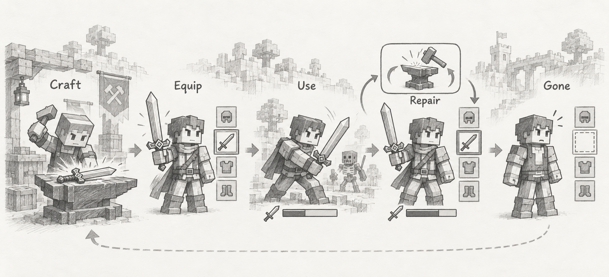

*Repair delays item loss; an item disappears when durability reaches zero. Bar lengths are illustrative.*

---

# 9. Spells and Abilities

## 9.1 Spell items

Spells are physical, tradable player-made objects rather than permanent account unlocks.

A spell can be:

- crafted;
- stored in the bank;
- carried in the expedition inventory;
- sold through the marketplace;
- equipped by a Hero;
- moved between Heroes.

Spell production can require an appropriately upgraded magical crafting building such as the Mage Tower.

## 9.2 Eight spell slots

Each Hero has exactly **8 equipped spell/ability slots** for the current baseline design.

A player may own many more spell items, but only eight are available to a Hero's combat loadout.

## 9.3 Equipment requirements

Spells may require specific equipment Types or Tags.

Examples:

```text
Cleave
Requires: Weapon Type == Axe
```

```text
Curse Explosion
Requires: at least one equipped item tagged Cursed
```

```text
Flaming Bulwark
Requires: Shield equipped AND at least one Flame-tagged item
```

Removing the only item satisfying a spell requirement makes the loadout invalid until the spell or equipment is changed.

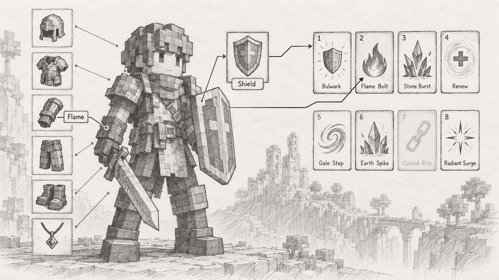

*Equipment Types and Tags enable spells in an eight-slot loadout, allowing roles to emerge without classes.*

## 9.4 Data-driven formulas

Spells should not rely only on fixed damage numbers.

Their effects are computed from data-driven formulas that can reference the caster, target, loadout and combat context.

Examples:

```text
Shield Bash:
4 + 0.4 × Physical Defense
```

```text
Firebolt:
10 + 1.0 × Magic Power
```

```text
Curse Burst:
0.4 × Magic Power × NumberOfEquippedItemsWithTag(Cursed)
```

Possible formula inputs include:

- Physical Power;
- Physical Defense;
- Magic Power;
- Magic Defense;
- current/max HP;
- AP/MP state;
- distance;
- equipped item Type counts;
- equipped Tag counts;
- target statuses;
- surrounding units;
- other explicit combat-context values.

The formula system should remain constrained and data-driven rather than becoming unrestricted arbitrary scripting in the first version.

---

# 10. Exploration

## 10.1 Third-person direct control

Exploration uses third-person direct movement.

The currently controlled Hero moves with standard real-time input such as WASD/controller movement and collision against the voxel environment.

The controlled Hero is not forced to move from traversal node to traversal node.

A character-controller style movement solution is preferred to an unconstrained physics rigid body, while still using world collision, gravity, stairs/slopes and other geometry normally.

## 10.2 Physical followers

The other active Heroes are physically present in the World.

They can:

- trigger enemy vision;
- trigger traps;
- occupy different positions;
- start an encounter;
- become separated;
- begin combat from their actual positions.

Followers have a simple first-version behavior:

- **Follow** the currently controlled Hero using pathfinding and preferred relative formation;
- **Stay** in their current area;
- allow the player to switch direct control to another Hero.

Follower AI does not initially reason intelligently about enemy vision cones or traps. Poor formation placement in narrow or dangerous areas is an accepted first-version behavior.

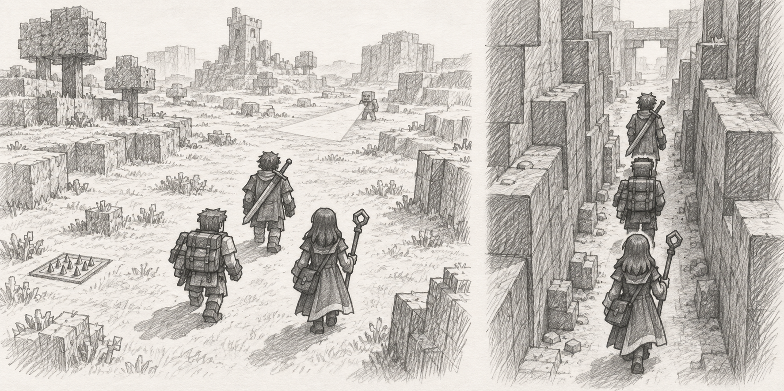

*Physical followers maintain a preferred formation in open areas and compress through narrow passages.*

## 10.3 Formation

A preferred formation defines relative placement for following Heroes.

Followers try to maintain those offsets when space permits and compress naturally in narrow corridors.

Formation is not an RTS command system. It is a follower-positioning preference around the currently controlled Hero.

## 10.4 Detection

The first version uses **vision only**.

```text
Enemy cannot see player → unaware
Enemy gains line of sight → alerted
Enemy moves toward target
Enemy reaches engagement condition → encounter begins
```

Detection does not immediately teleport the player into combat. The enemy chases in real time, allowing the player to flee, reposition or intentionally pull enemies toward favorable terrain.

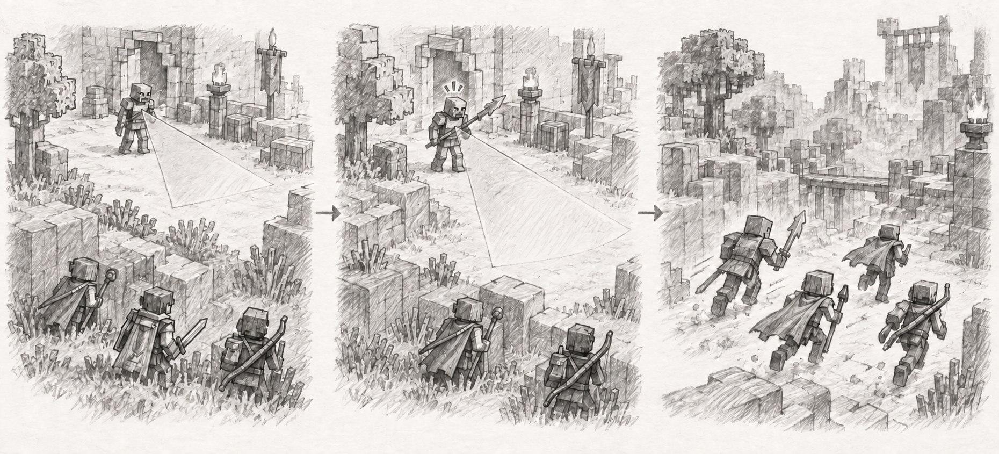

*Enemy vision leads to a real-time chase before engagement begins a tactical encounter.*

Later versions may add:

- noise;
- bushes/concealment;
- lighting;
- Hero perception/stealth modifiers;
- enemy-specific senses.

---

# 11. Exploration Traversal Actions

Jumping, climbing and similar traversal are treated as explicit **Exploration Actions**, not as unrestricted platforming mechanics and not as permanent edges in the walking navigation graph.

## 11.1 Action targeting

When the player activates an action such as Jump or Climb:

```text
Third-person exploration
    ↓
Activate traversal action
    ↓
Camera transitions to top-down targeting view
    ↓
Valid destination cells are displayed
    ↓
Player selects a destination
    ↓
Action executes
    ↓
Camera returns to third person
```

The same targeting concepts used by tactical combat can therefore be reused for exploration traversal.

## 11.2 World Clock continues

Entering top-down targeting during exploration does **not** create another simulation clock and does not pause the World.

Enemies continue patrolling or chasing while the player selects a target.

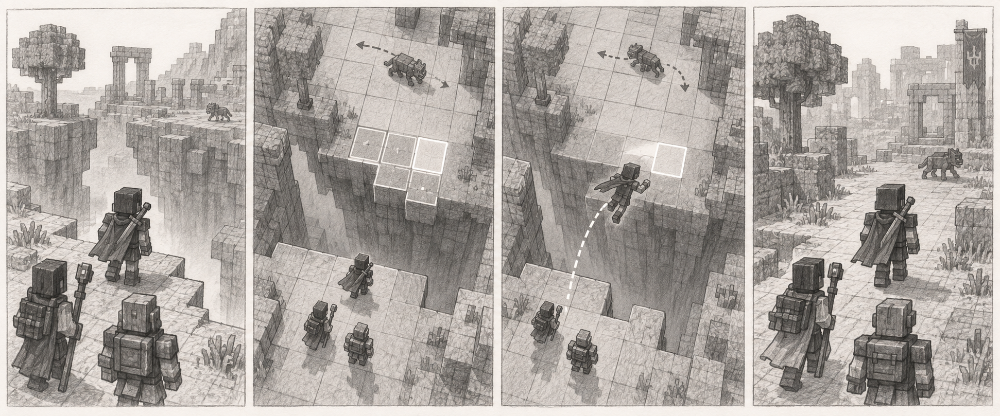

*A Jump uses top-down destination targeting while the surrounding World continues to run.*

## 11.3 Followers reproduce special traversal when possible

When the controlled Hero performs a special traversal action, followers in Follow mode try to reconnect with the controlled Hero.

For a Jump, a follower can:

1. check whether normal walking pathfinding can already reach the player;
2. if not, evaluate valid Jump destinations;
3. choose the smallest/cheapest valid jump that reconnects the follower to a walkable region leading toward the player;
4. execute the jump and resume normal following.

If no valid action can reconnect the follower, that Hero remains frozen/stationary until the player manually switches to it and resolves the situation.

The walking traversal graph therefore remains focused on walking connectivity.

---

# 12. Voxel Navigation

## 12.1 Walking traversal graph

Voxel geometry exposes navigation information through a concept equivalent to the existing `CardinalHeightSet` prototype.

Each voxel shape can describe the standing/traversal height at:

- positive X edge;
- negative X edge;
- positive Z edge;
- negative Z edge;
- center/stationary position.

Voxel orientation transforms these values into world directions.

A walking graph can connect neighboring surfaces when their exit/entry heights are compatible and there is sufficient free space for the actor.

This allows cubes, slabs, stairs and slopes to participate in navigation according to their actual shape.

## 12.2 Multiple traversable surfaces per column

A combat/navigation node remains associated with a 3D voxel position rather than only an `(x,z)` coordinate.

This permits multiple traversable surfaces in the same horizontal column, such as:

- ground under a bridge;
- bridge deck;
- stacked dungeon floors;
- balconies and caves.

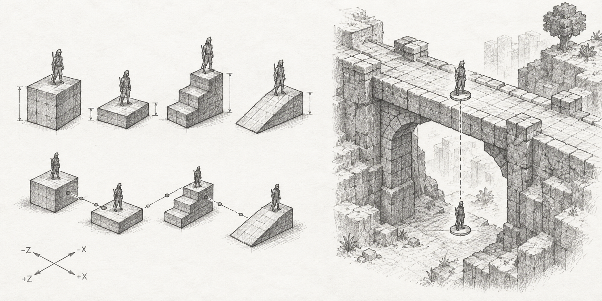

*Voxel shapes determine walking connections; ground and bridge surfaces remain separate navigation positions.*

## 12.3 Navigation responsibilities

The walking graph is primarily used for:

- enemy exploration pathfinding;
- follower pathfinding;
- deriving combat cells;
- tactical movement.

Directly controlled third-person movement remains continuous and collision-based.

Navigation derives from authoritative world terrain. Fine visual cells in Hero, equipment and prop models do not automatically become traversal nodes, collision primitives or combat cells. Dynamic obstacles and entity occupancy require explicit gameplay data independent of their animated visual parts.

---

# 13. Encounter Time Model

The time-domain model is one of the fundamental rules of Erelia.

## 13.1 World / Region Clock

Every active region runs continuously on its World/Region Clock.

It controls normal simulation such as:

- player exploration;
- enemy patrols;
- chasing;
- gathering interaction;
- out-of-combat actions;
- environmental simulation.

## 13.2 Encounter Clocks

Every tactical battle creates its own independent **Encounter Clock**.

A region may contain several simultaneous encounters.

```text
Region Clock
├── normal entities
├── Encounter A → Encounter Clock A
├── Encounter B → Encounter Clock B
└── Encounter C → Encounter Clock C
```

Combat participants are temporarily controlled by the Encounter Clock rather than the World Clock.

## 13.3 Paused tactical decision-making

When a player-controlled combat unit becomes ready and requires a decision, only that Encounter Clock pauses.

The surrounding World continues running normally.

This allows players unlimited tactical thinking time without freezing the entire MMO region.

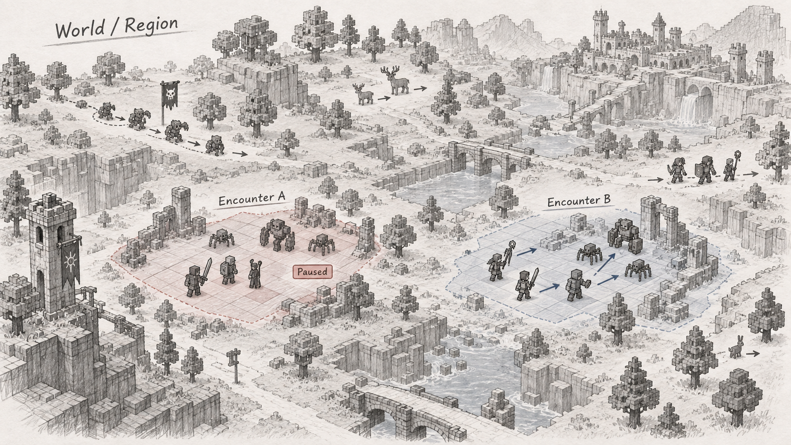

*A player decision pauses only its local Encounter Clock; the World and other encounters continue independently.*

---

# 14. Encounter Creation and Handoff

## 14.1 Initial participant synchronization

When an encounter is triggered, initial participants must transfer from World simulation into tactical simulation cleanly.

Each selected initial participant is handled as follows:

- an uncommitted targeting/selection action is cancelled;
- a currently executing committed action is allowed to finish;
- an idle or finished unit freezes immediately;
- a unit finishing its action freezes while waiting for the other initial participants.

When every initial participant is frozen:

```text
Snapshot final positions
    ↓
Build / resolve combat cells
    ↓
Transfer participants to Encounter Clock
    ↓
Encounter begins
```

Both player and enemy participants follow the same synchronization rule.

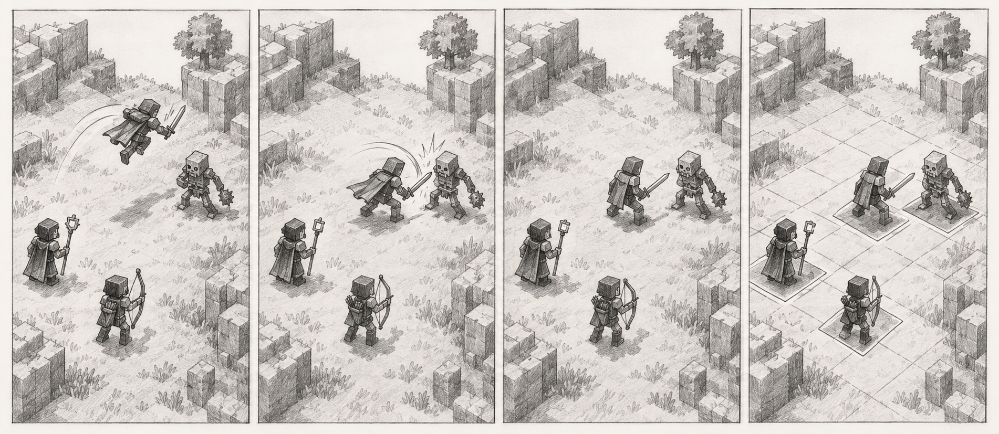

*Initial participants finish committed actions and freeze before their final positions become the tactical battlefield.*

## 14.2 Late arrivals are reinforcements

Once the initial participant set is locked, any later eligible unit is a **Reinforcement**.

This includes an entity arriving:

- during the pending synchronization phase;
- during action resolution;
- while the Encounter Clock is running;
- while the Encounter Clock is paused for a player decision.

Reinforcements do not restart or extend the initial synchronization barrier.

A reinforcement enters with **zero readiness progress / a fresh full Turn Interval**, so it does not immediately receive a free activation.

---

# 15. Surprise

Surprise is symmetric.

If a side performs the initiating hostile action while the opposing side is unaware, the surprising side begins the encounter **ready to act immediately**.

```text
Player surprises enemy
→ player-side initial units begin Ready
→ enemies begin with normal initial readiness
```

The reverse is also possible if enemies successfully ambush the players.

Surprise therefore rewards vision management, scouting and positioning without needing a separate pre-combat damage phase.

---

# 16. Combat Area

## 16.1 Combat cells

A tactical combat cell represents one traversable terrain-voxel surface with a one-world-unit horizontal footprint (1×1). Smaller visual voxels in models do not subdivide this tactical grid.

The cell retains a 3D standing position so stacked walkable surfaces remain distinct.

## 16.2 Combat Area Builder

Combat-area extraction is a separate algorithm/service from the combat rules themselves.

It consumes:

- the relevant World/chunks or traversal data;
- current participant positions;
- a configurable global combat radius.

It returns the currently relevant set of `CombatCell`s.

The first implementation should remain simple and radius-based. Later versions may account for connectivity, walls, cliffs, path distance, doors or other natural boundaries.

## 16.3 Elastic combat bubble

The combat area is not a permanently fixed arena.

Every current combatant contributes the same configurable global radius around itself. The effective combat area is the union of valid combat cells around all current participants.

```text
CombatArea = Union(ValidCellsWithinRadius(participant))
```

As participants move outward, the area grows around them. As they move back toward the center or leave the encounter, unused outer regions can shrink.

There is one global radius for all units in the first design.

Outside reinforcements therefore naturally extend the battle toward their approach direction when they enter.

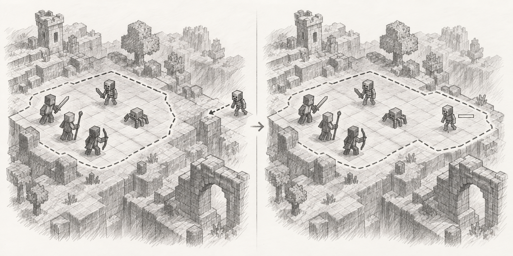

*An arriving reinforcement extends the combat area and begins with zero readiness progress.*

---

# 17. Readiness, Turns, AP and MP

## 17.1 Turn Interval

The old term **Stamina** is no longer preferred for the initiative system.

Each combat unit has a `TurnInterval`, measured in Encounter Clock seconds.

A lower Turn Interval means the unit has a shorter readiness cycle and therefore acts more frequently.

```text
Unit A TurnInterval = 4 s
Unit B TurnInterval = 7 s
```

Unit A is effectively faster because its bar is shorter, not because the same bar fills at a higher rate.

## 17.2 Readiness state

A unit tracks its progress toward the next activation.

Effects may manipulate readiness in different ways:

- **Stun** can stop readiness progression;
- **Speed Up** can reduce the Turn Interval;
- **Slow** can increase the Turn Interval;
- other effects may directly advance or delay the current readiness state.

Exact UI terminology (`Readiness`, `Ready in X seconds`, etc.) can be refined later.

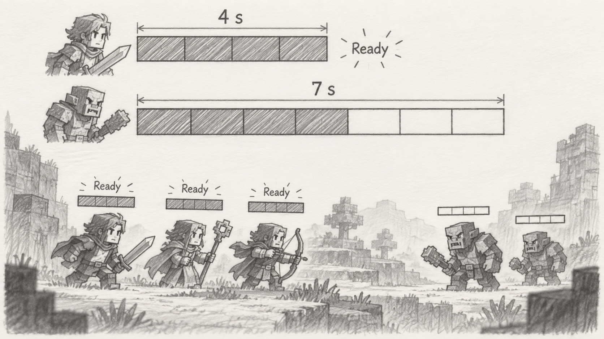

*A shorter Turn Interval means more frequent activations; the surprising side starts ready to act.*

## 17.3 AP and MP

All Heroes share common base AP and MP values.

Equipment may modify those values.

When a Hero becomes ready, its turn begins with the appropriate AP/MP available according to the combat rules.

- **AP** pays for spells and combat actions.
- **MP** pays for tactical movement.

There is no default Mana, Energy or Rage resource.

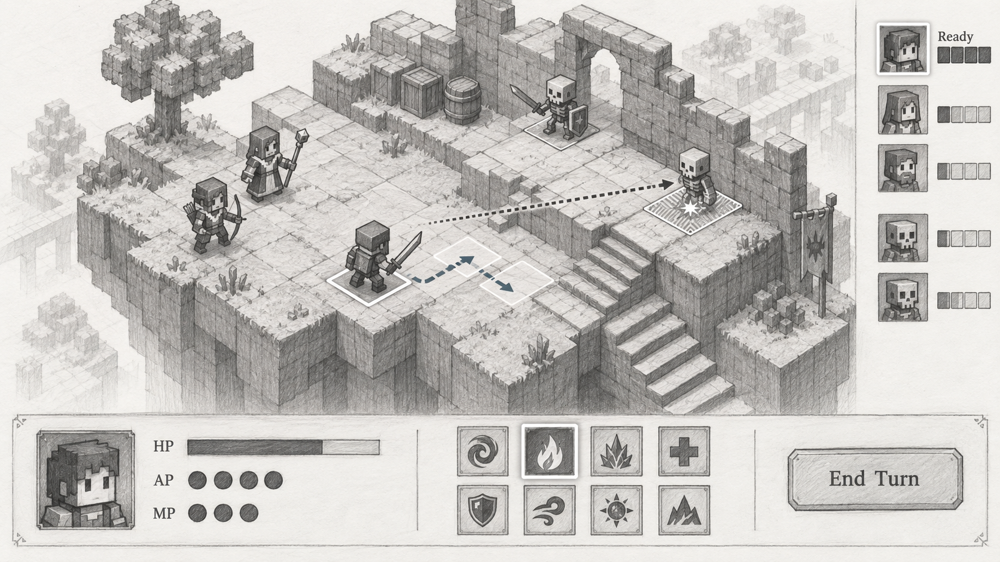

*Tactical interface proposal showing HP, AP, MP, readiness and eight spell slots; point counts are illustrative.*

---

# 18. Combat Stats and Damage

## 18.1 Core offensive and defensive stats

The baseline combat-stat model intentionally remains small:

- Physical Power;
- Physical Defense;
- Magic Power;
- Magic Defense.

Additional generic derived stats may include:

- Critical Chance;
- Critical Multiplier;
- Range;
- AP;
- MP;
- Turn Interval modifiers;
- HP and other necessary survival values.

## 18.2 Damage computation

Offensive value is computed by the spell formula.

A spell explicitly determines whether it deals physical or magical damage and how its raw value scales.

Defense is then applied separately as a **percentage reduction with diminishing returns**, conceptually similar to resistance systems used in games such as League of Legends.

```text
Spell formula
    ↓
Raw Physical or Magic Damage
    ↓
Critical modifier if applicable
    ↓
Corresponding target Defense
    ↓
Percentage reduction
    ↓
Final Damage
```

The exact mathematical constant/formula is a balancing parameter and is not fixed in this GDD.

## 18.3 Critical hits

Critical hits exist.

Critical Chance and Critical Multiplier can be modified by equipment.

Individual spells can specify whether they are eligible to critically hit.

---

# 19. Spell Targeting and Usage Rules

## 19.1 Cell-based targeting

Combat targeting is cell-based in the style of tactical games such as Dofus/Wakfu.

A spell can define:

- minimum range;
- maximum range;
- whether Range modifiers apply;
- line-of-sight requirement;
- linear-only restriction;
- diagonal rules;
- valid target categories;
- area-of-effect shape.

Possible AoE shapes include:

- single cell;
- line;
- cross;
- circle;
- cone;
- custom authored patterns.

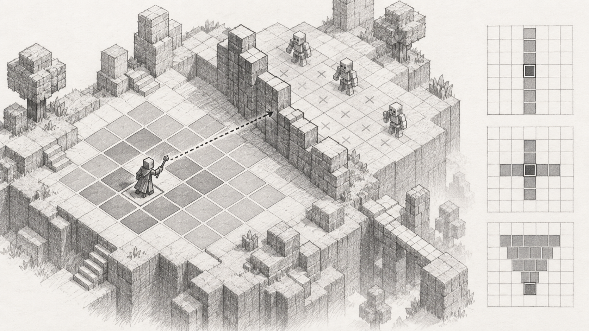

*Spell targeting combines cell range, line of sight and authored area-of-effect shapes.*

## 19.2 Modifiable range

Equipment may provide a generic Range stat.

A spell with base range `3–6` can become `3–8` on a Hero with `+2 Range` if that spell allows range modification.

Some spells may mark their range as fixed.

## 19.3 Usage restrictions

Spells support reusable usage constraints such as:

- AP cost;
- cooldown measured in the acting unit's activations/turns;
- maximum uses per turn;
- maximum uses against the same target per turn;
- maximum uses per encounter where desired;
- conditional target restrictions.

Example:

```text
Fire Bolt
AP Cost: 2
Cooldown: 0
Max Uses / Turn: 2
Max Uses / Target / Turn: 1
```

This allows repeatable spells without allowing one target to be hit repeatedly when that is not intended.

---

# 20. Status Effects and Combat Hooks

Statuses are event-driven rather than tied to one universal duration system.

## 20.1 Status structure

Conceptually, a status contains:

- persistent state;
- effects;
- hooks/triggers;
- expiration rules.

A status may react to hooks such as:

- OnTurnStart;
- OnTurnEnd;
- EverySecond;
- OnAPSpent;
- OnMPSpent;
- OnSpellCast;
- OnMovement;
- OnCellEntered;
- OnDamageDealt;
- OnDamageReceived;
- OnCriticalHit;
- OnDeath;
- other explicit combat events.

## 20.2 Examples

```text
Poison
Hook: OnTurnStart
Effect: deal damage
Expiration: after 3 triggers
```

```text
Burning
Hook: EverySecond
Effect: deal damage
Expiration: after 6 Encounter seconds
```

```text
Blood Pact
Hook: OnAPSpent
Effect: lose HP per AP consumed
Expiration: defined by status
```

A status can subscribe to several hooks if necessary.

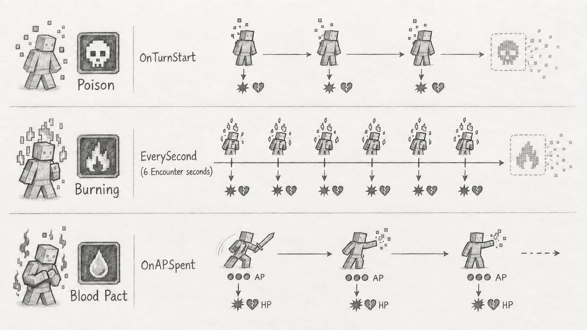

*Poison reacts to turn starts, Burning to encounter simulation seconds and Blood Pact to AP use; simulation time pauses during tactical decisions.*

## 20.3 Shared effect vocabulary

Spells and statuses should reuse the same effect vocabulary where possible, including:

- DealDamage;
- Heal;
- ModifyStat;
- ModifyTurnInterval;
- modify current readiness;
- prevent readiness progression;
- Push/Pull;
- Teleport/Swap;
- ApplyStatus;
- RemoveStatus;
- SpawnEntity;
- other bounded game effects.

---

# 21. Temporary Combat Entities and Summons

Combat can create temporary entities without modifying permanent voxel terrain.

Examples include:

- walls;
- barriers;
- traps;
- zones;
- totems;
- portals;
- turrets;
- summoned creatures.

Every such object is owned by the Encounter and is removed when that Encounter ends.

A temporary wall is therefore an Encounter entity occupying combat cells rather than permanent voxel placement.

## 21.1 Summons

The initial summon implementation reuses the normal combat-unit pipeline.

A summon can have:

- HP;
- AP/MP;
- Turn Interval;
- combat stats;
- spells/actions;
- statuses;
- combat-cell position.

Initially, a player-controlled summon may simply receive a normal controllable turn like a Hero. Automatic summon behaviors can be added later.

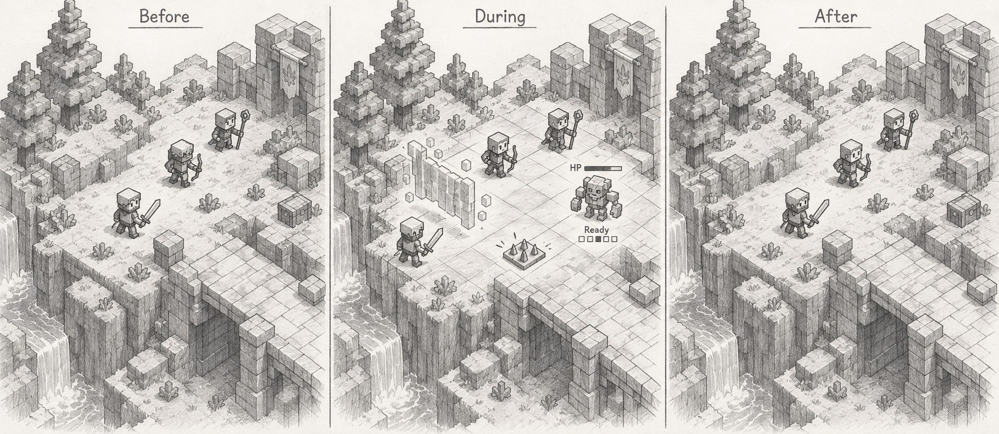

*Temporary barriers, traps and summons disappear at encounter end, leaving permanent terrain unchanged.*

---

# 22. Fleeing, Defeat and Recovery

## 22.1 Flee action

Leaving combat is an explicit **Flee** combat action rather than movement across an arbitrary arena wall.

Flee availability is checked per Hero.

A baseline condition is that no hostile unit may be within a configurable threat range of that Hero.

Other conditions can be added later if needed.

## 22.2 After a Hero flees

A fleeing Hero leaves the Encounter but does not immediately resume free exploration.

That Hero waits/freeses outside the fight while the same player's other participating Heroes continue fighting.

The player remains attached to the encounter until every Hero from that player's participating squad has either:

- fled; or
- been defeated.

Only then does that player's surviving escaped team regain World control.

If the encounter is still active because other players are fighting, the escaped player may later approach and re-enter as a normal Reinforcement, starting with fresh/zero readiness.

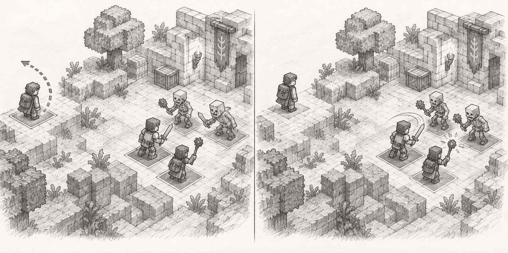

*A Hero who flees waits outside the encounter while the same player's other Heroes continue fighting.*

## 22.3 Defeat

A Hero reaching the defeat condition becomes incapacitated and can no longer act normally in that encounter.

By default, defeat is not permanent death.

After battle, a defeated Hero recovers at **1 HP**, creating a reason to use healing services, consumables or support abilities before the next encounter.

## 22.4 Full team defeat

If all of a player's active Heroes are defeated, the player respawns at the last activated Respawn Point, expected to commonly be associated with a permanent settlement/Guild Center.

There is no additional default punishment such as currency loss, durability penalty or experience loss.

---

# 23. Enemy and Summon Combat Model

Enemies use the same fundamental combat model as Heroes.

They share concepts such as:

- HP;
- AP/MP;
- Turn Interval;
- Physical/Magic Power and Defense;
- critical stats;
- spells;
- cooldowns;
- status effects;
- cell movement;
- temporary entities;
- targeting rules.

The difference is the source of their values.

A Hero derives much of its combat configuration from equipment and equipped player-owned spells.

An enemy has authored stats and an authored spell list directly, without requiring equipment to justify them.

Summons similarly receive their stats/spells from the summon definition.

---

# 24. Enemy AI — Gambit System

Enemy tactical AI is an ordered **Condition → Target → Reaction** rule list inspired by the Gambit system of Final Fantasy XII.

The AI evaluates rules from top to bottom and executes the first rule that can be satisfied.

Example:

```text
Goblin Archer

1. IF enemy within 2 cells
   TARGET nearest enemy
   REACTION move away using available MP

2. IF Piercing Shot is castable AND enemy within preferred range
   TARGET nearest valid enemy
   REACTION cast Piercing Shot

3. IF all enemies are too far away
   TARGET nearest enemy
   REACTION move toward preferred range

4. IF Basic Shot is castable
   TARGET nearest valid enemy
   REACTION cast Basic Shot

5. Pass turn
```

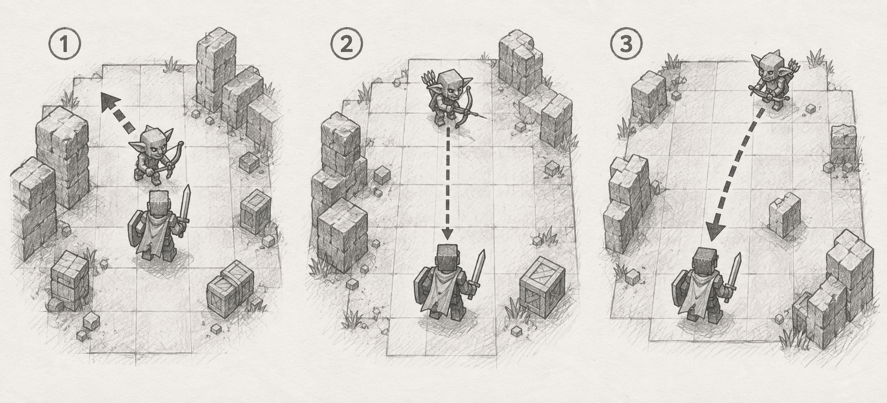

*An enemy archer uses ordered Gambit rules to retreat, attack or approach according to distance and castability.*

Reusable conditions can inspect data such as:

- distance;
- HP thresholds;
- ally/enemy counts;
- spell castability;
- AP/MP;
- statuses;
- area-of-effect opportunity;
- preferred range.

Reusable reactions can include:

- cast spell;
- move toward target;
- move away;
- maintain a range band;
- move toward an ally;
- move to a selected cell;
- pass turn.

The same serialized Gambit format should eventually be usable by the separate content editor for custom enemy/dungeon proposals. The runtime should not maintain a separate privileged AI system for official content.

---

# 25. Gathering and Resource Nodes

## 25.1 Gathering tools

Gathering has no Hero profession level.

Any Hero can gather a resource as long as the player has the correct gathering tool of sufficient tier.

Examples:

- pickaxe for ore;
- axe for wood;
- other tools for future resource families.

Higher-tier tools require appropriately upgraded town crafting buildings.

## 25.2 Resource nodes

Resource nodes are shared server entities.

```text
Resource available
    ↓
Player gathers it
    ↓
Resource disappears for every player
    ↓
Respawn timer
    ↓
Resource becomes available again
```

World generation should therefore create many resource spawn points so scarcity creates movement and competition without making gathering unreasonably frustrating.

Resource locations are not automatically recorded on the player's map in the first version. Learning where valuable gathering zones exist is part of player knowledge.

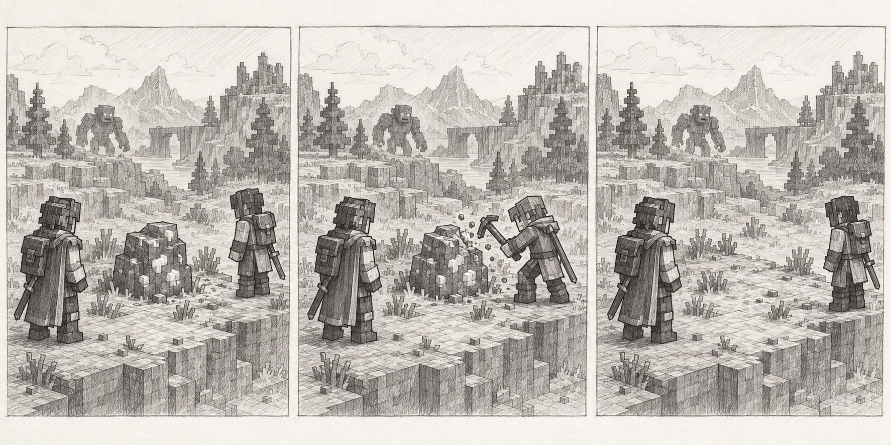

*Gathering depletes a shared resource node for every player without changing the permanent voxel terrain.*

## 25.3 Wilderness danger

Resource zones should frequently coexist with roaming enemies or nearby hazards. Gathering is therefore part of exploration risk rather than an isolated peaceful minigame.

---

# 26. Refining and Crafting

## 26.1 Refining

Raw resources are converted into refined materials before many crafting recipes can use them.

Higher tiers use increasingly expensive raw-to-refined conversion ratios.

Conceptually:

```text
Tier 1: small amount of raw material → 1 refined unit
Tier 2: larger amount → 1 refined unit
Tier 3: significantly larger amount → 1 refined unit
...
```

The exact progression does not need to be exponential, but higher tiers should consume substantially more raw gathering effort.

## 26.2 Universal crafting access

There are no player crafting professions or crafting skill levels.

Any player can craft an item when:

- the server has unlocked the required building/recipe;
- the player has the required resources;
- the player can pay any associated crafting fee.

## 26.3 Player-only finished-item economy

The intended baseline is that finished persistent items such as equipment and spells originate from player crafting/trading rather than being generated freely as ordinary monster drops.

PvE reward systems can still award finished items by purchasing existing player-made items from the marketplace.

---

# 27. Enchantment

Crafting creates the base item. Enchantment deliberately modifies its semantic build properties.

## 27.1 Deterministic result

An enchantment defines a known intended result.

Example:

```text
Add Flame Tag
Cost: defined magical resources + gold
Success result:
- add Flame
- Physical Power -8%
```

The resulting Tag/stat transformation is not randomly selected.

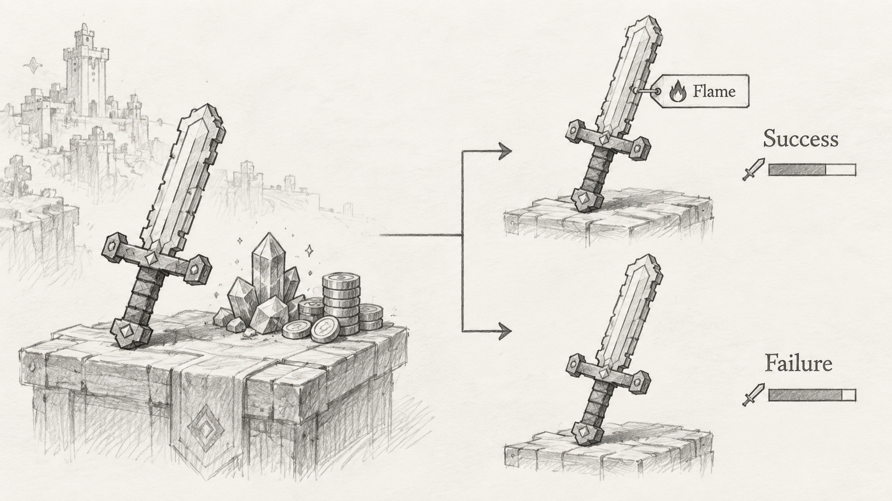

*An enchantment has a known result; a basic failure spends its costs and leaves the item unchanged.*

## 27.2 Success chance

An enchantment operation may have an RNG success chance.

On a basic failure:

- the requested modification is not applied;
- consumed resources/gold remain spent;
- the existing item remains otherwise unchanged.

Harsher failure consequences can be introduced for specific advanced enchantments later, but item destruction is not required as the baseline.

## 27.3 Add and remove Tags

The Enchantment Building supports both adding and removing Tags through the same general system.

Enchantments may also define tradeoffs such as:

- stat reduction;
- removal of another Tag;
- replacement of a Tag;
- item-Type transformation;
- other deterministic modifications.

Higher Enchantment Building levels unlock more powerful transformations and may improve success probabilities where desired.

---

# 28. Player Economy

## 28.1 Currency

The economy uses one universal gold-like currency.

There is no need for barter to be the primary trading model.

## 28.2 Gold sources

Gold enters the economy through activities such as:

- monsters;
- loot chests;
- NPC quests;
- dungeon rewards;
- game purchases of player-made marketplace items for PvE rewards.

## 28.3 Gold sinks

Gold leaves the economy through services such as:

- marketplace taxes;
- transaction taxes;
- healing;
- Hero creation/recruitment fee if retained;
- crafting fees;
- refining fees where useful;
- enchantment costs;
- repairs;
- other town/outpost services.

Because the Feat system has been removed, Feat-validation fees are no longer part of the current design.

## 28.4 Marketplace

The first implementation should favor a **server-wide marketplace** for simplicity and liquidity.

Marketplace access is provided from relevant permanent settlements and active outposts.

A future local-market model could be reconsidered if transport, regional scarcity and trading routes become sufficiently important to justify fragmented markets.

---

# 29. Inventory and Bank

## 29.1 Expedition inventory

Each player has one fixed-size expedition inventory shared by the player's three active Heroes.

Inventory is **per player**, not per Hero.

It carries:

- gathered resources;
- dungeon resources;
- consumables;
- spare equipment/spells;
- loot and other carried objects.

The fixed capacity forces players to eventually return to civilization or an active outpost to unload.

The first design should use simple slots/stack sizes rather than weight simulation.

## 29.2 Global bank

Permanent towns share one player/account bank.

Active outposts with storage service connect to that same bank.

Items deposited in one town can therefore be withdrawn from another town/outpost with bank access.

The bank is intentionally global to avoid turning the first version into a logistics/transport inventory game.

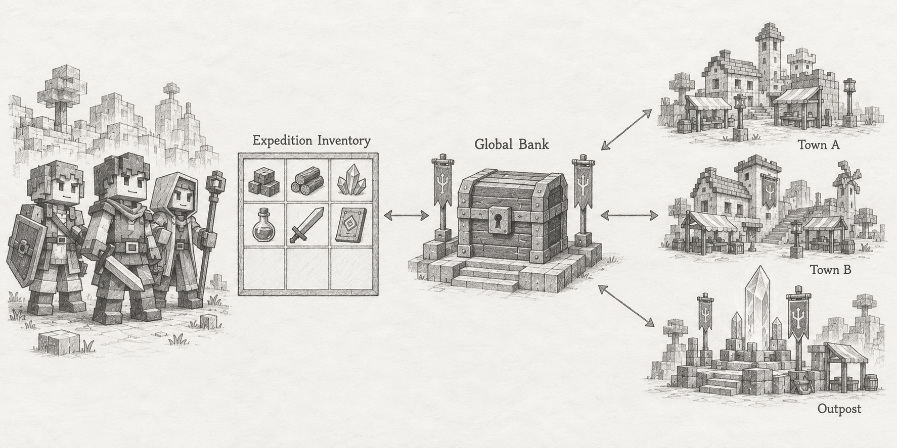

*Each player's three Heroes share one expedition inventory and one bank accessible from towns and active outposts.*

---

# 30. Normal Dungeons

Normal dungeons serve three main purposes.

## 30.1 Specialized resources

Dungeons contain resources required for advanced crafting through:

- enemy drops;
- dungeon gathering nodes;
- rare materials;
- dungeon-specific components.

## 30.2 Grand Dungeon training

Normal dungeons act as smaller training grounds for the Grand Dungeon.

They introduce subsets of:

- enemy families;
- spells;
- tactical behaviors;
- traps;
- environmental mechanics;
- boss concepts.

The Grand Dungeon later combines and intensifies those lessons.

## 30.3 World access

A normal dungeon can provide keys or permanent personal access unlocks that open additional parts of a World.

Examples:

- a one-use item that passes a magical barrier;
- a permanent authorization allowing a player to enter a subregion;
- access to a route containing higher-tier resources;
- discovery of an alternate dungeon entrance.

These are opportunities, not a mandatory global checklist.

## 30.4 Non-linear dungeon choice

Players choose which normal dungeons to complete.

The Grand Dungeon should not simply require `N/N dungeons completed` unless a specific World deliberately uses such a mechanic.

Skilled or well-equipped groups may attempt the Grand Dungeon with less preparation.

---

# 31. Dungeon Entrances, Quests and Access Routes

A dungeon may have several entrances located at different positions in the World.

Possible entrance types include:

- obvious locked main gate;
- hidden always-open entrance;
- entrance discovered through an NPC quest chain;
- entrance requiring a key or traversal capability.

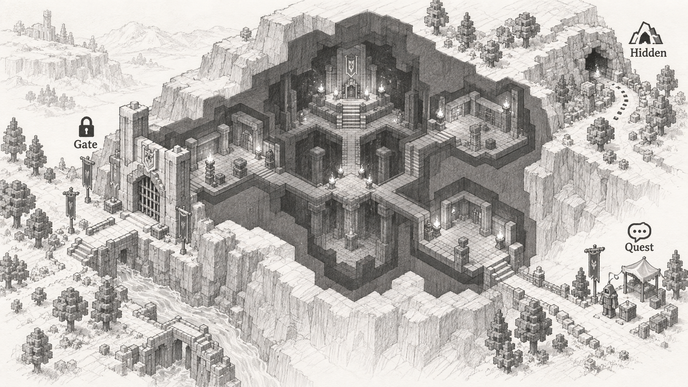

*Multiple entrances offer different routes and starting locations within the same dungeon instance.*

Different entrances lead into the same dungeon instance but can produce different starting locations.

Hidden entrances allow exploration-focused players to bypass directed questing, while NPC quests provide guided players with a structured way to discover important content.

Quests use a conventional NPC-driven model:

```text
Talk to NPC
→ accept quest
→ tracked objectives
→ completion
→ reward / information / access
```

A quest can reveal a secret without being the only legal way to use it. If a player discovers the place independently, the game should generally respect that discovery.

---

# 32. Dungeon Generation and Rotation

## 32.1 Instanced per group

Dungeons are instantiated per party/group rather than being one globally shared interior simulation.

Within the instance, exploration still uses a normal regional simulation clock and fights create independent Encounter Clocks just as they do in the overworld.

The dungeon is **not** one enormous tactical battle.

## 32.2 Handcrafted modular rooms

Dungeon geometry is built from handcrafted voxel rooms/features assembled by a Wave Function Collapse or similar constraint-driven modular algorithm.

A room asset can expose data such as:

- voxel geometry;
- size;
- connectors;
- tags;
- compatibility constraints;
- semantic anchors as needed.

The room format should be data-driven enough to support a separate content-authoring/editor workflow later.

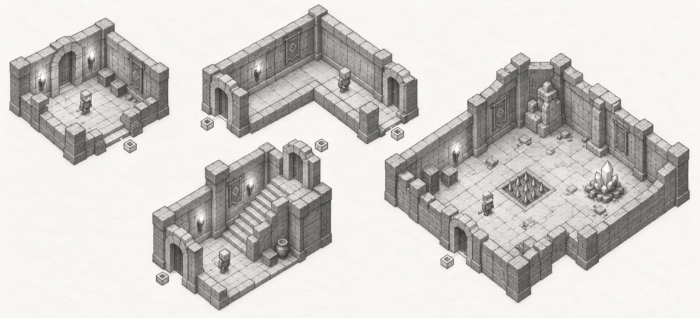

*Room-kit visual proposal; architecture and contents are examples for future authored modules.*

## 32.3 Deterministic rotation

Dungeon layouts rotate on a configurable server schedule.

A typical official-server target is roughly ten days, but the value is not hard-coded.

Each server has:

- `ServerSeed`;
- `RotationEpoch`;
- `RotationDuration`.

Conceptually:

```text
RotationIndex = floor((CurrentTime - RotationEpoch) / RotationDuration)
DungeonSeed = Hash(ServerSeed, DungeonID, RotationIndex)
```

During one rotation, leaving and re-entering the dungeon regenerates the same deterministic structural configuration while resetting runtime state such as enemies, traps, doors and bosses.

A new rotation produces a new deterministic layout.

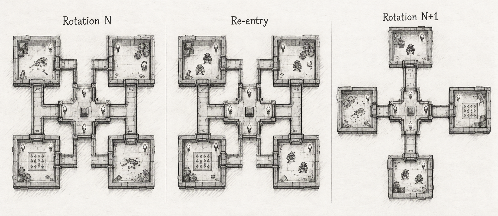

*Re-entry preserves the layout within a rotation and resets runtime state; the next rotation changes the layout.*

---

# 33. Dungeon Completion and Vaults

Every normal dungeon has a clear completion objective and final reward state.

A typical structure is:

```text
Enter
→ explore / fight / gather
→ reach final objective
→ defeat final encounter / boss
→ vault unlocks
→ collect rewards
→ dungeon completed
```

The vault is an explicit satisfying end to the run.

---

# 34. Marketplace-Funded PvE Rewards

PvE can reward finished player-crafted items without generating those items from nothing.

## 34.1 Reward budget

A chest/dungeon defines a **total marketplace reward value**, not a nominative list of exact item drops.

Example concept:

```text
Marketplace Reward Budget: 8,000 gold-equivalent
Eligible categories: equipment / spells / consumables of suitable tier
```

The game uses market data such as robust recent average selling prices to select eligible player-listed items whose combined value fits the reward budget.

## 34.2 Procurement loop

```text
PvE reward source completes
    ↓
Determine reward budget
    ↓
Find eligible marketplace listings
    ↓
Game purchases selected player-made items
    ↓
Sellers receive gold
    ↓
Purchased items appear in the chest/vault
```

This preserves the rule that finished equipment/spells originate from player production while allowing PvE to drop exciting finished objects.

The game purchase creates gold and must therefore be balanced alongside other gold sources.

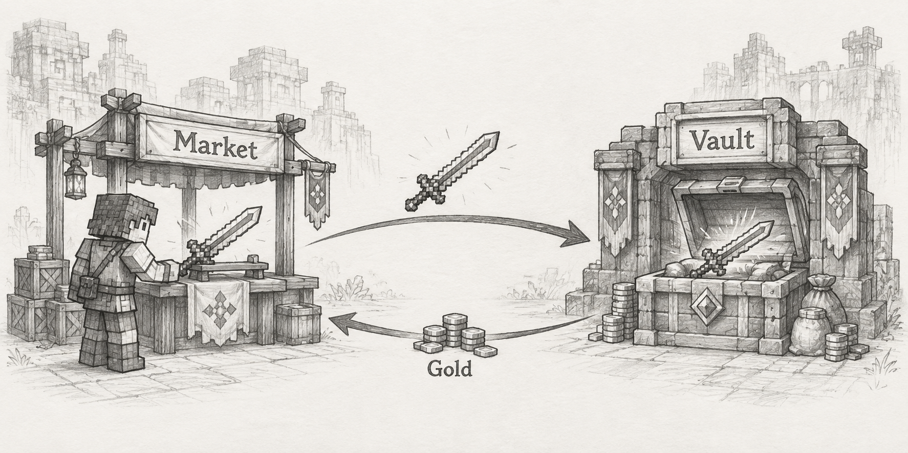

*PvE rewards purchase player-crafted marketplace items for a vault, while the sellers receive procurement gold.*

## 34.3 Price manipulation protection

The exact algorithm is an implementation/economy topic, but procurement must eventually defend against manipulation through techniques such as:

- robust moving averages;
- category/tier price bounds;
- sufficient transaction history;
- listing eligibility rules;
- outlier rejection.

The GDD does not lock the exact algorithm yet.

---

# 35. Grand Dungeon

The Grand Dungeon follows the same core dungeon rules as normal dungeons:

- instanced per group;
- rotating deterministic layout;
- exploration plus local tactical encounters;
- gathering/resources;
- final completion objective;
- marketplace-budget vault rewards.

It does **not** require a fundamentally different loot system.

Its unique server-level reward is:

> The first successful completion activates the portal to the next World for the entire server.

After the portal has been activated, the Grand Dungeon remains repeatable as a high-level dungeon with its normal rewards and rotation.

---

# 36. Overworld Enemy Camps

The overworld contains predefined potential enemy-camp locations generated with the World.

Only a subset are active at a time.

Example:

```text
20 possible camp sites
4 active camps
```

When an active camp is cleared:

```text
Camp defeated
→ reward chest becomes available
→ site becomes inactive
→ another inactive predefined site is selected
→ new camp activates there
```

This keeps the wilderness dynamic while guaranteeing camps only appear in valid authored/generated locations.

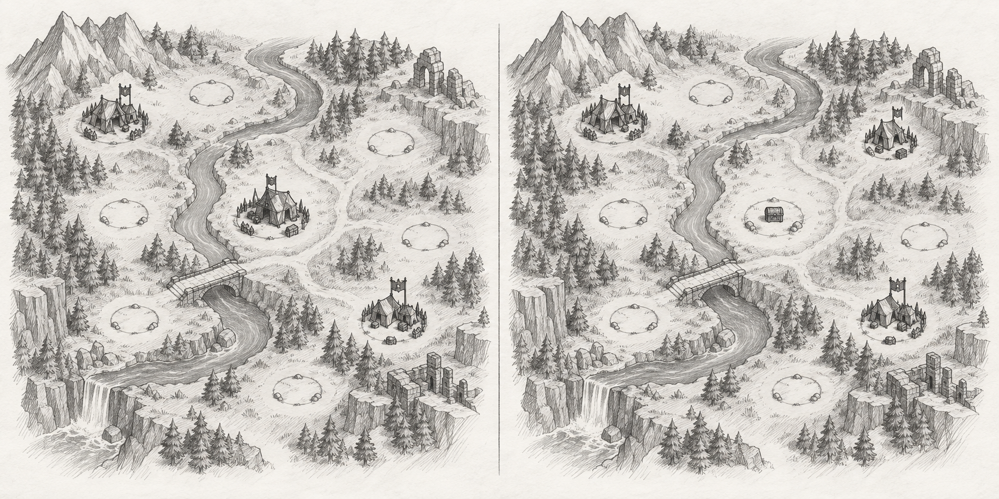

*Clearing an active camp leaves a reward chest and activates another predefined wilderness site.*

Camp reward chests can use the same marketplace-funded reward-budget system as dungeons, with appropriately smaller budgets.

The same predefined-site pattern may later support other dynamic overworld activities.

---

# 37. Telemetry and Cloud Goals

Erelia's online architecture should produce useful gameplay events for live operations, balancing and the project's cloud/data-learning goals.

Possible event families include:

- World entered/exited;
- resource gathered;
- resource node depleted/respawned;
- item crafted;
- item enchanted;
- item broken;
- marketplace listing/sale;
- town contribution;
- building upgraded;
- outpost activated/deactivated;
- dungeon entered/completed/abandoned;
- camp cleared;
- spell used;
- damage/healing;
- reinforcement joined;
- Hero fled/defeated;
- World portal activated.

Analysis can answer questions such as:

- which spell/equipment combinations dominate;
- which Tags are frequently combined;
- which dungeons are abandoned;
- where players fail in Grand Dungeons;
- resource scarcity and spawn pressure;
- item creation/destruction rate;
- market inflation and liquidity;
- outpost usage and upkeep burden;
- party-size performance.

Telemetry should be event-oriented and authoritative-server driven where practical.

---

# 38. Technical Multiplayer Direction

This GDD is not a complete software architecture specification, but the gameplay implies several technical requirements.

The server should be authoritative for important shared state such as:

- player accounts and persistent inventory;
- Hero rosters/loadouts;
- World progression;
- town upgrades;
- active outposts;
- shared resource-node availability;
- camps;
- marketplace;
- dungeon instances;
- encounter simulation;
- rewards/economy transactions.

Voxel chunk geometry can remain deterministic from seeds while dynamic entity state is synchronized separately.

The target voxel architecture keeps headless volume data separate from graphical surfaces. Terrain Chunks and runtime-sized models share one volume/Definition/Shape contract and one mesher, with neighbor resolution supplied separately for streamed terrain and standalone models. Chunk generation and streaming remain world responsibilities.

Authoritative simulation determines movement, collision, combat occupancy and effect timing. Animation and material effects present those outcomes; animation keyframes and rendered geometry do not determine damage or other gameplay results. Dynamic replication uses explicit entity state rather than treating every visual voxel as a networked object.

This direction is first validated in Playground using Sparkle Version0.1.1. Generic components may move into Sparkle after their reuse is demonstrated; that extraction is not a prerequisite for the visual prototype. The detailed migration and regression requirements live in the [implementation backlog](../backlog/README.md).

A local authoritative host may support early validation while preserving the same command boundary required by a later dedicated server. This is an implementation stage, not a change to the persistent online game target.

---

# 39. Future Content Editor

Initial voxel assets are authored with mature external voxel/3D tools and imported into the shared volume representation. Character hierarchy, pivots, attachments and transform animations may use external tooling or lightweight declarative metadata. The exact tool and interchange format remain open decisions. A custom voxel-modeling or animation application is not required for the visual prototype or first playable.

A separate editor application may eventually allow players/community creators to propose custom content such as:

- dungeon room assets;
- dungeon compositions;
- enemy definitions;
- enemy Gambit profiles;
- spells or controlled gameplay definitions where permitted.

The official game runtime should consume the same data formats for official content where possible.

The editor, moderation, publishing, security and distribution workflow are explicitly **not** core first-version gameplay requirements and should be designed separately.

---

# 40. Current Design Decisions Summary

The following are considered current baseline decisions:

- persistent online voxel Worlds;
- one multi-scale voxel representation for terrain, characters, equipment and props;
- rigid voxel-part character animation with separately attached equipment;
- external asset authoring/import and early material/visual validation;
- deterministic server-rooted World generation;
- immutable base voxel terrain;
- server-wide World portal progression;
- sparse permanent towns;
- server-wide independent building upgrades;
- predefined public temporary outposts with upkeep;
- unlimited blank-Hero roster and three active Heroes per player;
- no classes;
- no Feat progression system;
- equipment defines stats, one Type and zero/more Tags;
- Tags have no intrinsic effects and are interpreted by spells;
- eight equipped spells per Hero;
- spells/equipment are player-crafted and tradable objects;
- all persistent equipment has durability and eventually breaks;
- universal crafting access with no profession levels;
- refining gets increasingly resource-expensive by tier;
- deterministic enchantment result with possible RNG success/failure;
- third-person exploration with physical followers;
- vision-only detection first, with later stealth extensions;
- walking traversal graph derived from voxel surface information;
- explicit top-down exploration actions for Jump/Climb/etc.;
- continuous World Clock plus independent Encounter Clocks;
- combat decisions pause only their Encounter Clock;
- initial participant synchronization and 0-readiness reinforcements;
- symmetric Surprise;
- elastic combat bubble around participants;
- per-Hero Flee action;
- defeat is temporary; default post-battle recovery at 1 HP;
- common base AP/MP modified by equipment;
- Turn Interval controls activation frequency;
- no Mana resource;
- physical/magical offense and defense stats;
- data-driven spell formulas;
- percent-based defense reduction with diminishing returns;
- critical hits;
- Dofus-like cell range/LoS/AoE targeting;
- cooldown, uses-per-turn and uses-per-target restrictions;
- hook-driven statuses;
- temporary combat entities removed at encounter end;
- summons initially reuse normal CombatUnit behavior;
- ordered Gambit AI;
- shared server resource nodes with respawns;
- fixed player expedition inventory plus global bank;
- instanced rotating modular dungeons;
- non-linear normal-dungeon progression;
- NPC quests as optional guidance/access paths;
- marketplace-funded PvE item rewards;
- rotating overworld enemy camps at predefined sites;
- one universal gold currency.

---

# 41. Major Open Design Questions

The following subjects remain intentionally unresolved or only partially specified. They are higher-value future design work than fine-tuning already-defined edge cases.

## 41.1 Exact Hero stat sheet

The four central offense/defense stats are defined, but the complete stat list still needs consolidation:

- base HP;
- base AP/MP;
- base Turn Interval;
- exact critical defaults;
- Range behavior;
- possible push/pull resistance or other tactical stats.

## 41.2 Equipment stat-generation model

Crafted items roll within ranges, but the exact relationship between:

- item tier;
- recipe;
- stat budget;
- individual stat ranges;
- item durability;
- quality distribution

still needs a formal model.

## 41.3 Spell-item stat variation

Spells are tradable crafted objects, but the exact set of spell properties that may vary per crafted copy remains to be defined.

## 41.4 Durability and repair

The game needs exact rules for:

- durability loss triggers;
- repair cost;
- whether repairs restore full maximum durability;
- whether maximum durability itself can degrade;
- durability treatment of spell items and tools.

## 41.5 Combat balance formulas

Still tunable:

- Physical/Magic Defense reduction formula;
- critical multiplier baseline;
- AP/MP defaults;
- Turn Interval defaults;
- combat-bubble radius;
- flee threat radius;
- reinforcement insertion details.

## 41.6 Town building catalog

Building progression is defined structurally, but each permanent town's actual building set, tiers, recipes and contribution costs require content design.

## 41.7 World tier count and cadence

The number of Worlds, expected playtime per World, resource tiers, town spacing and Grand Dungeon cadence remain content-production questions.

## 41.8 Marketplace procurement algorithm

PvE reward procurement needs an economically robust method for determining fair average prices and selecting eligible listings without creating exploitable price loops.

## 41.9 PvP

No PvP design is currently part of the established GDD. It should not be assumed until intentionally designed.

---

# 42. First Playable Scope Recommendation

## 42.1 Visual validation prerequisite

Before broad gameplay/content production, [VS-000 — Unified Voxel Visual Validation](../backlog/milestones/VS-000-UNIFIED-VOXEL-VISUAL-VALIDATION.md) proves one scene containing generated terrain Chunks, cubes/slabs/slopes/stairs, a palette-material prototype, an imported small-scale barrel, an articulated Hero and an attached voxel weapon.

All voxel geometry uses the same volume-to-mesh path. The scene must preserve existing terrain behavior, demonstrate stable materials, animate rigid parts without remeshing, and capture performance measurements. Record visual acceptance or required revisions before expanding the art catalog. Tool selection, precise material sampling and entity collision primitives remain implementation decision gates.

## 42.2 First playable gameplay slice

A useful first vertical slice does not need the entire MMO progression. It builds on the accepted visual prototype; [VS-001 — First Playable](../backlog/milestones/VS-001-FIRST-PLAYABLE.md) provides its system acceptance criteria.

A focused prototype can validate the core loop with:

- one generated World;
- one permanent town;
- a small number of independently upgradeable buildings;
- one or two resource tiers;
- gathering nodes and shared depletion;
- refining and basic crafting;
- item Type/Tag/stat generation;
- one Enchantment Building;
- three-Hero roster/squad flow;
- third-person exploration and followers;
- vision/chase encounter initiation;
- voxel-derived combat cells;
- World/Encounter clock split;
- readiness/AP/MP tactical combat;
- eight-spell loadouts;
- formula-based physical/magical effects;
- Gambit-driven enemies;
- one normal modular dungeon;
- one Grand Dungeon;
- one dormant outpost crystal;
- one marketplace-backed reward chest;
- one next-World portal activation event.

This slice would test the distinctive parts of Erelia without requiring every long-term content system to exist at once.
